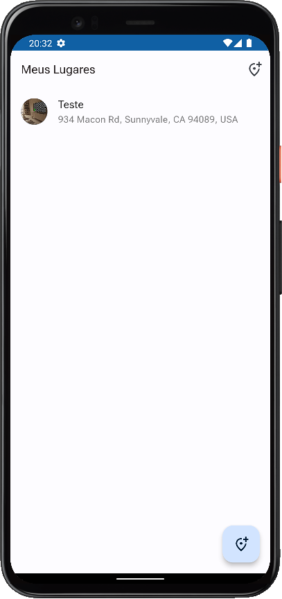
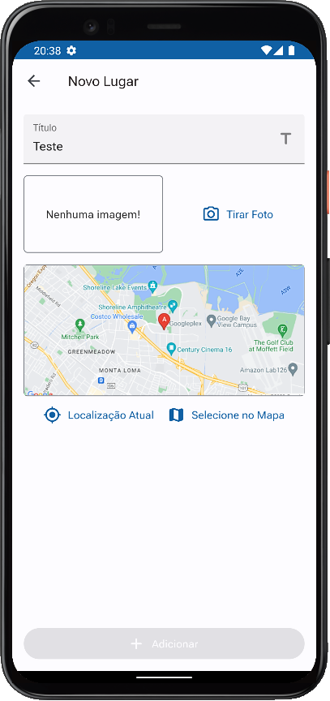

# great-places-app

<p align="left">
    
   <!--  -->
   
</p>

App de cadastro e exibição de locais utilizando a API do Google Maps e armazenamento dos dados em um Banco de Dados relacional local. App desenvolvido com a linguagem Dart e framework Flutter.

## :hammer: Funcionalidades do projeto
* `Cadastro de local:` cadastro de local com título, opção para fotografar o local e localização por meio do Google Maps.
* `Visualizar localização:` opção para visualizar a localização de um local cadastrado.
* `Persistência de dados:` dados do usuário serão persistidos no app por meio de um Banco de Dados relacional local.

<br>
<div display: inline_block align="center">
   
   
</div>

## :file_folder: Acesso ao projeto
Você pode [acessar o código-fonte do projeto](https://github.com/GabrielSchiavo/great-places-app) ou [baixá-lo](https://github.com/GabrielSchiavo/great-places-app/archive/refs/heads/main.zip).

## :hammer_and_wrench: Abrir e rodar o projeto
Após baixar o projeto, você pode abrir com o Visual Studio Code. Para o projeto funcionar você deve ter configurado em seu PC:

* Flutter - Versão >=2.18.2 <3.0.0

Abra um terminal na pasta raiz do projeto e execute estes comandos:
```bash
dart pub get
```
```bash
flutter pub get
```

* `Configurando a API do Maps:`
Acesse a documentação oficial da Plataforma Google Maps em https://developers.google.com/maps/documentation/android-sdk/cloud-setup e https://developers.google.com/maps/documentation/android-sdk/get-api-key. Nos arquivos do projeto encontre todas as ocorrências de "[Your Maps API Key]" e substitua pela sua chave da API gerada e encontre todas as ocorrências de "com.exemple.app" e substitua por um ID de pacote único de sua escolha.

Agora ao abrir o projeto com o Visual Studio Code, abra o arquivo "main.dart" localizado na pasta "lib", agora pode executar ou depurar no seu smartphone, em um emulador Android ou iOS, no Windows ou no navegador.

## :white_check_mark: Tecnologias utilizadas
* `Dart - 2.18.2`
* `Flutter - 3.3.6`
* `SQLite`
* `flutter launcher icons - 0.10.0`
* `flutter native splash - 2.2.14`
* `provider - 6.0.4`
* `image_picker - 0.8.6`
* `path_provider - 2.0.11`
* `path - 1.8.2`
* `sqflite - 2.2.2`
* `location - 4.4.0`
* `google_maps_flutter - 2.2.2`
* `http - 0.13.5`
* `Material Design 3`
